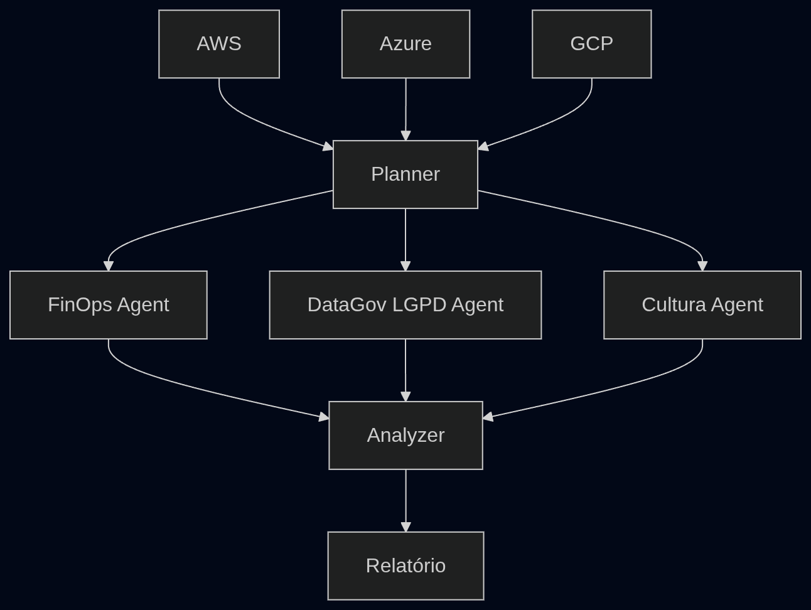

# Sistema Multi-Agent de Governança Cloud

Sistema local que simula uma arquitetura serverless multi-agent para governança de infraestrutura multi-cloud. Combina análise de custos (FinOps), conformidade com a LGPD (Data Governance), mapeamento de cultura organizacional e correlação de riscos via LLM, tudo orquestrado com LangGraph.

---

## Sumário

- [Visão Geral](#visão-geral)
- [Arquitetura](#arquitetura)
- [Estrutura de Pastas](#estrutura-de-pastas)
- [Instalação](#instalação)
- [Configuração](#configuração)
- [Como Usar](#como-usar)
- [Agentes](#agentes)
- [Cloud Providers](#cloud-providers)
- [LLM Provider](#llm-provider)
- [RAG — Análise de Cultura](#rag--análise-de-cultura)
- [Relatório de Saída](#relatório-de-saída)
- [Migrando para Produção](#migrando-para-produção)
- [Exemplos de Execução](#exemplos-de-execução)

---

## Visão Geral

O sistema processa dados estruturados de recursos cloud e documentos organizacionais, executa um pipeline de agentes especializados em paralelo e gera um relatório executivo consolidado com insights e ações priorizadas.

## Arquitetura



**O que cada camada faz:**

| Camada | Responsabilidade |
|---|---|
| **Cloud Providers** | Fornecem dados de recursos (mock local ou SDK real) |
| **Agentes** | Processam dados com lógica Python determinística |
| **LLM (OpenAI)** | Gera narrativa e insights executivos sobre dados já calculados |
| **LangGraph** | Orquestra o fluxo com paralelismo e roteamento condicional |
| **S3 Simulado** | Persiste relatórios em disco como `storage/reports/` |

> **Regra fundamental:** Agentes processam dados. LLM interpreta dados. O LLM nunca calcula valores nem classifica riscos — isso é responsabilidade dos agentes.

---


### Simulações Locais de Serviços AWS

| Serviço AWS | Simulação local |
|---|---|
| AWS Lambda | `orchestration/lambda_sim.py` — executa funções com retry e fault injection |
| AWS Step Functions | `orchestration/step_functions.py` — orquestra steps sequenciais e paralelas |
| Amazon S3 | `storage/s3_sim.py` — armazena objetos JSON no filesystem local |

### Camada MCP (Model Context Protocol)

Todos os agentes recebem e retornam dados através de um envelope padronizado:

```python
{
    "input":        {},   # dados brutos de entrada
    "context":      {},   # contexto injetado (outputs de agentes anteriores)
    "memory":       {},   # estado persistente entre steps
    "execution_id": ""    # rastreabilidade
}
```

---

## Estrutura de Pastas

```
multi_agent_gov/
│
├── main.py                         # Entrypoint principal
├── config.py                       # Variáveis de ambiente centralizadas
├── logger.py                       # Logging estruturado (structlog)
├── requirements.txt
├── .env.example                    # Modelo de configuração
│
├── agents/                         # Agentes com lógica Python pura
│   ├── planner_agent.py            # Decide quais agentes executar
│   ├── finops_agent.py             # Custo, ociosidade, tagueamento
│   ├── data_governance_agent.py    # Classificação de risco LGPD
│   ├── cultura_agent.py            # Análise cultural + RAG
│   └── analyzer_agent.py          # Correlação cruzada + narrativa LLM
│
├── providers/
│   ├── base.py                     # Interface LLMProvider (summarize, correlate)
│   ├── mock_provider.py            # Fallback offline sem API key
│   ├── openai_provider.py          # Provider real OpenAI
│   └── cloud/
│       ├── base.py                 # Interface CloudProvider + CloudResource (CCM)
│       ├── mock_aws.py             # Dados AWS fixos (sem boto3)
│       ├── mock_gcp.py             # Dados GCP fixos (sem SDK)
│       ├── mock_azure.py           # Dados Azure fixos (sem SDK)
│       ├── real_aws.py             # boto3: EC2 + S3 + RDS + Cost Explorer
│       ├── real_gcp.py             # google-cloud: Compute + Storage
│       ├── real_azure.py           # azure-mgmt: VM + Storage + SQL
│       └── __init__.py             # Factory mock/real por env var
│
├── orchestration/
│   ├── graph.py                    # Definição do grafo LangGraph
│   ├── lambda_sim.py               # Simulação de AWS Lambda
│   └── step_functions.py           # Simulação de AWS Step Functions
│
├── mcp/
│   └── context.py                  # MCPContext + MCPResponse
│
├── parser/
│   └── md_parser.py                # Extrai JSON e Markdown do arquivo .md
│
├── rag/
│   ├── embedder.py                 # Embeddings locais (sentence-transformers)
│   └── vector_store.py             # FAISS vector store com persistência
│
└── storage/
    ├── s3_sim.py                   # Simulação de bucket S3
    ├── report_writer.py            # Persiste e formata relatórios
    ├── reports/                    # Relatórios JSON por execution_id
    └── vector_db/                  # Índice FAISS persistido
```

---

## Instalação

**Pré-requisitos:** Python 3.11+

```bash
# 1. Clone ou descompacte o projeto
cd multi_agent_gov

# 2. Crie e ative um virtualenv
python -m venv .venv
source .venv/bin/activate        # Linux/macOS
# .venv\Scripts\activate         # Windows

# 3. Instale as dependências
pip install -r requirements.txt

# 4. Configure o ambiente
cp .env.example .env
# Edite .env e preencha OPENAI_API_KEY
```

---

## Configuração

Edite o arquivo `.env` na raiz do projeto:

```env
# ─── LLM Provider ────────────────────────────────────────────────────────────
LLM_PROVIDER=openai          # "openai" (padrão) | "mock" (sem API key)
OPENAI_API_KEY=sk-...        # obrigatório se LLM_PROVIDER=openai
OPENAI_MODEL=gpt-4o-mini     # modelo a usar

# ─── Cloud Providers ──────────────────────────────────────────────────────────
CLOUD_AWS_MODE=mock          # "mock" (padrão) | "real" (requer boto3)
CLOUD_GCP_MODE=mock          # "mock" (padrão) | "real" (requer google-cloud SDKs)
CLOUD_AZURE_MODE=mock        # "mock" (padrão) | "real" (requer azure-mgmt SDKs)

# ─── Input/Output ─────────────────────────────────────────────────────────────
INPUT_FILE=cultura.md
STORAGE_PATH=./storage/reports
VECTOR_DB_PATH=./storage/vector_db

# ─── Misc ────────────────────────────────────────────────────────────────────
LOG_LEVEL=INFO               # DEBUG | INFO | WARNING
FAILURE_RATE=0.0             # Simular falha nos providers (0.0 a 1.0)
```

---

## Como Usar

### Execução padrão

```bash
# Coloque o arquivo .md na raiz do projeto
python main.py
```

### Opções da CLI

```bash
# Arquivo personalizado
python main.py --file /caminho/para/meus_dados.md

# Execution ID customizado
python main.py --execution-id minha-execucao-001
```

### Variáveis de ambiente inline

```bash
# Modo totalmente offline (sem API key)
LLM_PROVIDER=mock python main.py

# AWS real + GCP mock + OpenAI
CLOUD_AWS_MODE=real python main.py

# Simular 30% de falha nos cloud providers
FAILURE_RATE=0.3 python main.py

# Debug verboso
LOG_LEVEL=DEBUG python main.py

# Tudo real
CLOUD_AWS_MODE=real CLOUD_GCP_MODE=real CLOUD_AZURE_MODE=real python main.py

# ORQUESTRADOR
ORCHESTRATOR=langgraph
```

### Saída esperada no console

```
╔══════════════════════════════════════════════════════════════╗
║       SISTEMA MULTI-AGENT DE GOVERNANÇA CLOUD                ║
╚══════════════════════════════════════════════════════════════╝
  Execução ID : a1b2c3d4
  LLM         : 🔴 openai
  AWS         : 🟡 mock
  GCP         : 🟡 mock
  Azure       : 🟡 mock

⚙️   Inicializando cloud providers...
    ✓ 3 provider(s) ativo(s): aws, gcp, azure

🔗  Executando fluxo LangGraph...
    Planner -> [FinOps ∥ DataGovernance ∥ Cultura] -> Analyzer

💾  Relatório salvo em: s3://governance-reports/reports/a1b2c3d4.json

════════════════════════════════════════════════════════════
  RELATÓRIO EXECUTIVO — GOVERNANÇA MULTI-CLOUD
════════════════════════════════════════════════════════════

💰 FINOPS
   Custo total mensal:    $  4,980.70
   Potencial de economia: $  1,430.55
   ...

🔒 GOVERNANÇA DE DADOS (LGPD)
   Score de conformidade: 46/100
   ...

🏢 CULTURA ORGANIZACIONAL
   Tipo: Conservadora | Maturidade: 3.5/10
   ...

🎯 ANÁLISE CONSOLIDADA
   Score de risco global: 4.6/10
   ...
```

---

## Agentes

### PlannerAgent

Inspeciona os dados disponíveis e decide dinamicamente quais agentes executar. Não usa LLM — a decisão é baseada em heurísticas Python puras: presença de recursos cloud, texto de cultura, quantidade de dados por domínio.

**Output:**
```python
{
    "active_agents": ["finops", "data_governance", "cultura"],
    "priority": "critical" | "high" | "medium" | "low",
    "rationale": "..."
}
```

---

### FinOpsAgent

Coleta recursos de todos os cloud providers e calcula métricas financeiras com aritmética Python pura. Não delega nenhum cálculo ao LLM.

**Lógica implementada:**
- Custo total e por provider
- Identificação de recursos ociosos (`is_idle == True`)
- Detecção de recursos sem tags de custo
- Cálculo de potencial de economia
- Alertas de custo acima de threshold ($500/mês por recurso)

**Output:**
```python
{
    "total_cost": 4980.70,
    "cost_by_provider": {"aws": 2405.55, "gcp": 744.40, "azure": 1830.75},
    "idle_count": 3,
    "idle_cost": 1430.55,
    "savings_potential": 1430.55,
    "untagged_count": 3,
    "idle_resources": [...],
    "recommendations": [...]
}
```

---

### DataGovernanceAgent

Classifica riscos LGPD com regras determinísticas. Detecta campos PII por nome, avalia exposição pública e ausência de controles de segurança. Referencia artigos específicos da LGPD.

**Regras de classificação:**

| Condição | Nível de Risco | Artigos LGPD |
|---|---|---|
| Público + PII crítico (CPF, RG, email) | 🔴 CRÍTICO | Art. 6, 46, 47, 48 |
| Público + sem controle de acesso | 🟠 ALTO | Art. 46, 49 |
| Sem controle de acesso (privado) ou sem criptografia | 🟡 MÉDIO | Art. 46 |
| Privado, com controle e criptografia | 🟢 BAIXO | — |

**PII detectado por categoria:**

```
Crítico: cpf, rg, email, senha, cartao, cnh, passaporte, biometria
Alto:    nome, telefone, endereco, cep, data_nascimento, ip_address
Médio:   user_id, session_id, device_id, client_id
```

**Output:**
```python
{
    "compliance_score": 46,   # 0-100
    "risk_summary": {"critical": 1, "high": 1, "medium": 2, "low": 3},
    "pii_exposure_count": 4,
    "findings": [
        {
            "resource_id": "s3://clientes-dados",
            "risk_level": "critical",
            "issues": ["bucket público", "sem criptografia", "sem controle de acesso"],
            "pii_fields": ["nome", "cpf", "email"],
            "lgpd_articles": ["Art. 6", "Art. 46", "Art. 47", "Art. 48"],
            "recommendation": "..."
        }
    ]
}
```

---

### CulturaAgent

Analisa documentos organizacionais para mapear perfil cultural e maturidade digital. Usa RAG (embeddings locais + FAISS) quando há conexão com HuggingFace para baixar o modelo de embeddings; cai graciosamente para keyword matching quando offline.

**Dimensões analisadas:**

| Dimensão | Como é medida |
|---|---|
| Tipo de cultura | Keywords: hierarquia, burocracia, agilidade, inovação |
| Maturidade digital (0–10) | Score composto por traços detectados |
| Digital readiness | Derivada do score de maturidade |
| Gargalos | Padrões de bloqueio e comunicação ineficiente |
| Pontos fortes | Sinais de abertura a mudança |

**Output:**
```python
{
    "culture_type": "Conservadora",
    "maturity_score": 3.5,
    "digital_readiness": "média",
    "traits": ["Tomada de decisão centralizada", ...],
    "bottlenecks": ["Aprovações em múltiplos níveis", ...],
    "strengths": ["Abertura incipiente a metodologias ágeis"],
    "llm_narrative": "Parágrafo gerado pelo OpenAI..."
}
```

---

### AnalyzerAgent

Recebe os outputs dos três agentes anteriores e executa correlação cruzada entre domínios com lógica Python. Ao final, chama o LLM para gerar **apenas** o sumário executivo narrativo.

**Correlações detectadas automaticamente:**

- Alto custo em recursos com violações LGPD críticas
- Cultura burocrática retardando remediação de recursos ociosos
- Ausência de tagueamento e controle de acesso como padrão sistêmico
- Custo elevado em recursos públicos combinando risco financeiro e legal

**Score de risco global:** média ponderada de custo, conformidade LGPD e maturidade cultural.

**Output:**
```python
{
    "overall_risk_score": 4.6,      # 0-10
    "correlated_issues": [...],
    "priority_actions": [...],
    "executive_summary": "Texto gerado pelo OpenAI...",
    "llm_insights": [...]
}
```

---

## Cloud Providers

### Como funciona a troca mock -> real

Cada cloud tem dois arquivos separados que implementam a mesma interface `CloudProvider`:

```python
class CloudProvider(ABC):
    def get_resources(self) -> list[CloudResource]: ...
    def provider_name(self) -> str: ...
```

A factory em `providers/cloud/__init__.py` instancia o correto com base na variável de ambiente. **Os agentes nunca sabem se estão falando com mock ou real.**

```
CLOUD_AWS_MODE=mock  ->  providers/cloud/mock_aws.py   (dados fixos, sem dependência)
CLOUD_AWS_MODE=real  ->  providers/cloud/real_aws.py   (boto3 + credenciais AWS)
```

### Modelo normalizado de recurso (CCM)

Todos os recursos, independente de provider, são normalizados em `CloudResource`:

```python
CloudResource {
    provider:           "aws" | "gcp" | "azure"
    service_type:       "compute" | "storage" | "database"
    service_name:       "ec2" | "s3" | "compute_engine" | ...
    region:             "us-east-1" | ...
    resource_id:        identificador único
    cost:               float (USD/mês)
    is_idle:            bool
    is_public:          bool
    has_encryption:     bool
    has_access_control: bool
    tags:               list[str]
    schema_hint:        list[str]  # campos detectados (para LGPD)
}
```

### Mocks AWS — dados incluídos

```
EC2  i-123         us-east-1   $820.45   ocioso
S3   bucket-clientes           $1200.00
S3   logs-aplicacao            $205.10
RDS  db-prod       eastus      $180.00
```

Para adicionar ou editar dados mock, modifique `providers/cloud/mock_aws.py` (e equivalentes GCP/Azure). Os dados são listas de `CloudResource` — sem nenhuma dependência de API.

---

## LLM Provider

O LLM é usado **somente para gerar narrativa** — nunca para cálculo ou classificação.

### Interface

```python
class LLMProvider(ABC):
    def summarize(self, domain: str, structured_data: dict) -> str:
        # Recebe dados já calculados, retorna parágrafo narrativo

    def correlate(self, finops, governance, cultura, correlations, risk_score) -> dict:
        # Recebe todos os outputs, retorna {"executive_summary": str, "insights": list}
```

### OpenAI (padrão)

```env
LLM_PROVIDER=openai
OPENAI_API_KEY=sk-...
OPENAI_MODEL=gpt-4o-mini
```

O `OpenAIProvider` constrói prompts executivos com os dados estruturados dos agentes e solicita ao modelo apenas narrativa — o JSON de dados é fornecido, não pedido para o LLM gerar.

### Mock LLM (offline)

```env
LLM_PROVIDER=mock
```

Gera narrativa determinística sem API key. Útil para CI/CD, testes e desenvolvimento sem custo de API. Produz textos marcados com `[MOCK]` para diferenciação.

---

## RAG — Análise de Cultura

O `CulturaAgent` usa RAG para contextualizar a análise nos documentos reais da organização:

**Pipeline:**
1. Texto do documento de cultura é dividido em chunks (300 palavras, overlap 50)
2. Chunks são embedados com `all-MiniLM-L6-v2` (modelo local, ~80MB)
3. Índice FAISS é persistido em `storage/vector_db/`
4. Durante análise, queries semânticas recuperam chunks relevantes
5. Chunks recuperados enriquecem o contexto do agente

**Fallback gracioso:** se o modelo de embeddings não puder ser baixado (sem internet ou domínio bloqueado), o agente continua funcionando com keyword matching — sem interromper o fluxo.

**Reutilização do índice:** se o índice FAISS já existir em disco, ele é carregado sem re-indexar. Para forçar reindexação, remova `storage/vector_db/`.

---

## Relatório de Saída

Cada execução gera dois outputs:

### 1. Arquivo JSON (S3 simulado)

```
storage/reports/governance-reports/reports__<execution_id>.json
```

Contém o estado completo do grafo: todos os outputs dos agentes, correlações, score de risco, sumário executivo e metadados de execução.

### 2. Console

Sumário formatado com seções por domínio, findings individuais, ações priorizadas e sumário executivo gerado pelo LLM.

---

## Migrando para Produção

### Passo 1 — AWS real

```bash
pip install boto3
aws configure                        # configura credenciais locais
```

```env
CLOUD_AWS_MODE=real
AWS_DEFAULT_REGION=us-east-1
```

O `RealAWSProvider` consulta automaticamente EC2, S3, RDS e Cost Explorer.

### Passo 2 — GCP real

```bash
pip install google-cloud-compute google-cloud-storage
export GOOGLE_APPLICATION_CREDENTIALS=/path/to/service-account.json
```

```env
CLOUD_GCP_MODE=real
GCP_PROJECT_ID=meu-projeto-gcp
```

### Passo 3 — Azure real

```bash
pip install azure-mgmt-compute azure-mgmt-storage azure-mgmt-sql azure-identity
```

```env
CLOUD_AZURE_MODE=real
AZURE_SUBSCRIPTION_ID=xxx
AZURE_TENANT_ID=xxx
AZURE_CLIENT_ID=xxx
AZURE_CLIENT_SECRET=xxx
```

### Passo 4 — Deploy em cloud

O sistema foi desenhado para migração gradual. A estrutura de providers/agentes mapeia diretamente para:

| Local | AWS Cloud |
|---|---|
| `orchestration/lambda_sim.py` | AWS Lambda (cada agente vira uma função) |
| `orchestration/step_functions.py` | AWS Step Functions (substitui o grafo LangGraph) |
| `storage/s3_sim.py` | Amazon S3 real (troca filesystem por `boto3.client("s3")`) |
| `storage/vector_db/` | Amazon OpenSearch ou pgvector no RDS |

---

## Exemplos de Execução

### Desenvolvimento (sem custo de API)

```bash
LLM_PROVIDER=mock python main.py
```

### Staging (OpenAI + dados mock)

```bash
OPENAI_API_KEY=sk-... python main.py
```

### Produção parcial (AWS real, resto mock)

```bash
CLOUD_AWS_MODE=real OPENAI_API_KEY=sk-... python main.py
```

### Orquestrador Step Functions

```bash
ORCHESTRATOR=step_functions python main.py
```

```bash
python main.py --orchestrator step_functions
```


### Teste de resiliência (30% de falha nos providers)

```bash
LLM_PROVIDER=mock FAILURE_RATE=0.3 python main.py
```

### Debug completo

```bash
LOG_LEVEL=DEBUG LLM_PROVIDER=mock python main.py 2>&1 | tee logs/debug.log
```

### Múltiplas execuções encadeadas

```bash
for env in dev staging prod; do
    python main.py --execution-id "run-${env}-$(date +%Y%m%d)" --file "data_${env}.md"
done
```

---

## Dependências

| Pacote | Versão | Uso |
|---|---|---|
| `langgraph` | ≥0.2.0 | Orquestração do fluxo multi-agent |
| `langchain-core` | ≥0.2.0 | Tipos base do LangGraph |
| `openai` | ≥1.30.0 | Provider LLM real |
| `sentence-transformers` | ≥3.0.0 | Embeddings locais para RAG |
| `faiss-cpu` | ≥1.7.4 | Vector store local |
| `numpy` | ≥1.26.0 | Operações vetoriais |
| `python-dotenv` | ≥1.0.0 | Carregamento do `.env` |
| `pydantic` | ≥2.7.0 | Validação de dados |
| `structlog` | ≥24.1.0 | Logging estruturado |

**Dependências opcionais (providers reais):**

```bash
# AWS real
pip install boto3

# GCP real
pip install google-cloud-compute google-cloud-storage google-cloud-billing

# Azure real
pip install azure-mgmt-compute azure-mgmt-storage azure-mgmt-sql azure-identity
```
